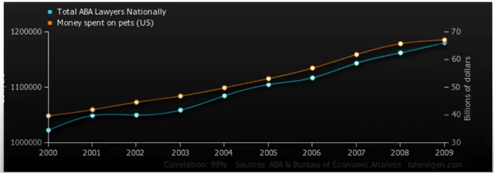
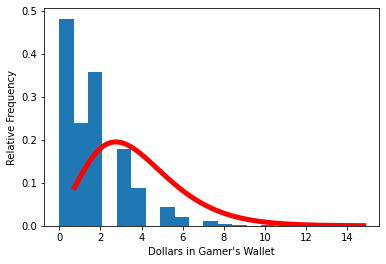
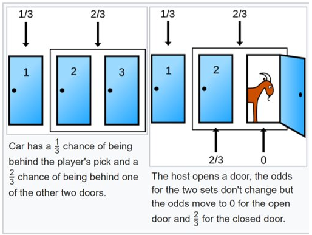
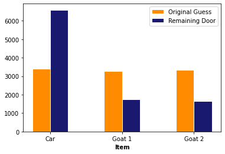

```python
%%html
<!--Script block to left align Markdown Tables-->
<style>
  table {margin-left: 0 !important;}
</style>
```


<!--Script block to left align Markdown Tables-->
<style>
  table {margin-left: 0 !important;}
</style>


# ENGR 1330 Computational Thinking with Data Science 
Last GitHub Commit Date: 18 February 2021

## Lesson 9 Data Modeling: Statistical Approach 

This lesson covers concepts related to modeling data - it is the start of several lessons on the subject.  The ultimate goal is to explain observed behavior with a model (like $\textbf{F} = m\textbf{a}$) so that the model can be used to predict behavior.  If we are predicting between existing observations, that's interpolation and is relatively straightforward.  If we are predicting beyond existing observations, that's called extrapolation and is less straightforward.

To get started we will examine the concepts of causality (cause => effect) and correlation, and the use of simulation to generate probability estimates.

## Objectives
- To understand the fundamental concepts involved in causality; and the difference between cause and correlation.
- To understand the fundamental concepts involved in iteration.
- To understand the fundamental concepts involved in simulation

---

## Computational Thinking Concepts
The CT concepts include:

- Algorithm Design => Causality, Iteration, Simulation 
- System Integration => Iteration, Simulation 


---
## Correlation and Causality

### What is causality? (A long winded psuedo definition!)

Causality is the relationship between causes and effects. 
The notion of causality does not have a uniform definition in the sciences, and is studied using philosophy and statistics. 
From the perspective of physics, it is generally believed that causality cannot occur between an effect and an event that is not in the back (past) light cone of said effect. 
Similarly, a cause could not have an effect outside its front (future) light cone.

- Here are some recent articles regarding Closed Time Loops, that explains causal consistency. The second paper is by an undergraduate student! 
    1. https://journals.aps.org/prl/abstract/10.1103/PhysRevLett.125.040605

    2. https://iopscience.iop.org/article/10.1088/1361-6382/aba4bc

- Both to some extent theoretically support our popular notion of time travel (aka Dr. Who)  without pesky paradoxes; someone with creative writing juices, could have a good science fiction career using these papers as a starting thesis!

In classical physics, an effect cannot occur before its cause. 
In Einstein's theory of special relativity, causality means that an effect can not occur from a cause that is not in the back (past) light cone of that event. 
Similarly, a cause cannot have an effect outside its front (future) light cone. 
These restrictions are consistent with the assumption that causal influences cannot travel faster than the speed of light and/or backwards in time. In quantum field theory, observables of events with a spacelike relationship, "elsewhere", have to commute, so the order of observations or measurements of such observables do not impact each other.

Causality in this context should not be confused with Newton's second law, which is related to the conservation of momentum, and is a consequence of the spatial homogeneity of physical laws. The word causality in this context means that all effects must have specific causes. 

Another requirement, at least valid at the level of human experience, is that cause and effect be mediated across space and time (requirement of contiguity). This requirement has been very influential in the past, in the first place as a result of direct observation of causal processes (like pushing a cart), in the second place as a problematic aspect of Newton's theory of gravitation (attraction of the earth by the sun by means of action at a distance) replacing mechanistic proposals like Descartes' vortex theory; in the third place as an incentive to develop dynamic field theories (e.g., Maxwell's electrodynamics and Einstein's general theory of relativity) restoring contiguity in the transmission of influences in a more successful way than in Descartes' theory.

Yada yada bla bla bla ...

---
### Correlation (Causality's mimic!)

The literary (as in writing!) formulation of causality is a "why?, because ..." structure (sort of like if=>then) The answer to a because question, should be the "cause."  Many authors use "since" to imply cause, but it is incorrect grammar - since answers the question of when?

Think "CAUSE" => "EFFECT"

Correlation doesn’t mean cause (although it is a really good predictor of the crap we all buy - its why Amazon is sucessfull)

Consider the chart below



The correlation between money spent on pets and the number of lawyers is quite good (nearly perfect), so does having pets cause lawyers?  Of course not, the general social economic conditions that improve general wealth, and create sufficient disposable income to have pets (here we mean companion animals, not food on the hoof) also creates conditions for laywers to proliferate, hence a good correlation. 

Nice video : Correlation and Causation https://www.youtube.com/watch?v=1Sa2v7kVEc0
<hr>
Quoting from http://water.usgs.gov/pubs/twri/twri4a3/

Concentrations of atrazine and nitrate in shallow groundwaters are measured in wells over a
several county area. For each sample, the concentration of one is plotted versus the
concentration of the other. As atrazine concentrations increase, so do nitrate. How might the
strength of this association be measured and summarized?

Streams draining the Sierra Nevada mountains in California usually receive less precipitation in
November than in other months. Has the amount of November precipitation significantly
changed over the last 70 years, showing a gradual change in the climate of the area? How might
this be tested?

The above situations require a measure of the strength of association between two continuous
variables, such as between two chemical concentrations, or between amount of precipitation and
time. How do they co-vary? One class of measures are called correlation coefficients. 

Also important is how the significance of that association can be tested for, to determine whether the observed pattern differs from what is expected due entirely to chance. 

Whenever a correlation coefficient is calculated, the data should be plotted on a scatterplot. No
single numerical measure can substitute for the visual insight gained from a plot. Many different
patterns can produce the same correlation coefficient, and similar strengths of relationships can
produce differing coefficients, depending on the curvature of the relationship. 

### Implications
Most research questions attempt to explain cause and effect. 
- In experimental research, the relationship is constructed and the experiment is somewhat of a failure if none of the presumed causal (causal == explainatory) variables influence the response (response == effect)
- In a data science experimental context, causality may be impossible to establish, however correlations can be established and exploited.

In data science, many studies involve observations on a group of individuals, a factor of interest called a treatment (explainatory variable, predictor variable, predictor feature ...), and an outcome (response, effect, state, predicted value ...) measured on each individual.

The presumptive establishment of causality takes place in two stages. 

1. First, an association is observed. Any relation between the treatment and the outcome is called an association (we can measure the strength of the association using correlation coefficients!).

2. Second, A more careful analysis is used to establish causality. 

    a. One approach would be to control all variables other than the suspected (explainatory) variables, which for any meaningful process is essentially impossible. 

    b. Another approach is to establish randomized control studies:
        1. Start with a sample from a population (e.g. volunteers to test Covid 19 vaccines)
        2. Randomly assign members to either
            a. Control group
            b. Treatment group
        3. Expose the two groups identically, except the control group recieves a false (null) treatment
        4. Compare the responses of the two groups, if they are same, there exists no evidence that the treatment variable CAUSES a response

These concepts can be extended with some ingenuity to engineered systems and natural systems.


Consider


Data Science Questions:
- Does going to school cause flu?
- Does flu cause school attendance?
- Does going to school contribute to the spread of flu?
- Does the spread of flu contribute to the school attendance?
- Are there other variables that affects both? 

  a. These are called  “confounding factors” or “lurking variables”.
  
  b. Cold weather?, more indoor time?, more interaction?

---
### Confounding Factors
  
An underlying difference between the two groups (other than the treatment) is called a confounding factor, because it might confound you (that is, mess you up) when you try to reach a conclusion.

For example, Cold weather in the previous example.

Confounding also occurs when explainatory variables are correlated to another, for instance flood flows are well correlated to drainage area, main channel length, mean annual precipitation, main channel slope, and elevation. However main channel length is itself strongly correlated to drainage area, so much so as to be nearly useless as an explainatory variable when drainage area is retained in a data model.  It would be a "confounding variable" in this context.

---
## Randomization

To establish presumptive causality in our data science experiments, we need randomization tools.
We can use Python to make psuedo-random choices. 
There are built-in functions in numpy library under random submodule.
The `choice` function randomly picks one item from an array.

The syntax is

`np.random.choice(array_name)`, where array_name is the name of the array from which to make the choice.​


```python
#Making Random Choice from an Array (or list)
import numpy as np
two_groups = np.array(['treatment', 'control'])
np.random.choice(two_groups,1)
# mylist = ['treatment', 'control']  # this works too
# np.random.choice(mylist)
```


    array(['treatment'], dtype='<U9')


The difference of this function from others that we learned so far, is that it doesn’t give the same result every time.
We can roll a dice using this function by randomly selecting from an array from 1 to 6. 


```python
my_die = np.array(['one', 'two','three', 'four','five', 'six'])
np.random.choice(my_die)
```


    'six'


```python
# now a bunch of rolls
print('roll #1 ',np.random.choice(my_die) )
print('roll #2 ',np.random.choice(my_die) )
print('roll #3 ',np.random.choice(my_die) )
print('roll #4 ',np.random.choice(my_die) )
print('roll #5 ',np.random.choice(my_die) )
print('roll #6 ',np.random.choice(my_die) )
```

    roll #1  four
    roll #2  four
    roll #3  four
    roll #4  five
    roll #5  six
    roll #6  one


```python
# or multiple rolls, single call
myDiceRolls = np.random.choice(my_die,6) 
print(myDiceRolls)
```

    ['six' 'two' 'two' 'six' 'one' 'five']


    'six'


We might need to repeat a process multiple times to reach better results or cover more results.
Let’s create a game with following rules:

- If the dice shows 1 or 2 spots, my net gain is -1 dollar.
- If the dice shows 3 or 4 spots, my net gain is 0 dollars.
- If the dice shows 5 or 6 spots, my net gain is 1 dollar.


```python
my_wallet = 1 # start with 1 dollars

def place_a_bet(wallet):
    print("Place your bet!")
    if wallet == 0:
        print("You have no money, get out of my Casino!")
        return(wallet)
    else:
        wallet = wallet - 1
        return(wallet)

def make_a_roll(wallet):
    """Returns my net gain on one bet"""
    print("Roll the die!")
    x = np.random.choice(np.arange(1, 7))  # roll a die once and record the number of spots
    if x <= 2:
        print("You Lose,  Bummer!")
        return(wallet) # lose the bet
    elif x <= 4:
        print("You Draw, Take your bet back.")
        wallet = wallet+1
        return(wallet) # draw, get bet back
    elif x <= 6:
        print("You win a dollar!")
        wallet = wallet+2
        return (wallet) # win, get bet back and win a dollar!
    


# Single play    
print("Amount in my account =:",my_wallet)
my_wallet = place_a_bet(my_wallet)
my_wallet = make_a_roll(my_wallet)
print("Amount in my account =:",my_wallet)

```

    Amount in my account =: 1
    Place your bet!
    Roll the die!
    You Lose,  Bummer!
    Amount in my account =: 0


A more automated solution is to use a for statement to loop over the contents of a sequence. Each result is called iteration. 
Here we use a for statement in a more realistic way: we print the results of betting five times on the die as described earlier. 
This process is called simulating the results of five bets. 
We use the word simulating to remind ourselves that we are not physically rolling dice and exchanging money but using Python to mimic the process.


```python
# Some printing tricks
CRED = '\033[91m'
CEND = '\033[0m'

my_wallet = 10
how_many_throws = 1 

for i in range(how_many_throws):
    print("Amount in my account =:",my_wallet)
    my_wallet = place_a_bet(my_wallet)
    my_wallet = make_a_roll(my_wallet)

#print(CRED + "Error, does not compute!" + CEND)
    print("After ",i+1," plays")
    print(CRED + "Amount in my account =:",my_wallet,CEND)
    print("_______________________")
```

    Amount in my account =: 10
    Place your bet!
    Roll the die!
    You win a dollar!
    After  1  plays
    Amount in my account =: 11 
    _______________________


## Simulation of multiple gamblers/multiple visits to the Casino

[https://www.inferentialthinking.com/chapters/09/3/Simulation.html](https://www.inferentialthinking.com/chapters/09/3/Simulation.html)


```python
outcomes = np.array([])  #null array to store outcomes

# redefine functions to suppress output

def place_a_bet(wallet):
    # print("Place your bet!")
    if wallet == 0:
        # print("You have no money, get out of my Casino!")
        return(wallet)
    else:
        wallet = wallet - 1
        return(wallet)

def make_a_roll(wallet):
    """Returns my net gain on one bet"""
    # print("Roll the die!")
    x = np.random.choice(np.arange(1, 7))  # roll a die once and record the number of spots
    if x <= 2:
        #print("You Lose,  Bummer!")
        return(wallet) # lose the bet
    elif x <= 4:
        #print("You Draw, Take your bet back.")
        wallet = wallet+1
        return(wallet) # draw, get bet back
    elif x <= 6:
        #print("You win a dollar!")
        wallet = wallet+2
        return (wallet) # win, get bet back and win a dollar!
    

# Some printing tricks
CRED = '\033[91m'
CEND = '\033[0m'


how_many_simulations = 100000

for j in range(how_many_simulations):
    my_wallet = 1
    how_many_throws = 30 

    for i in range(how_many_throws):
     #   print("Amount in my account =:",my_wallet)
        my_wallet = place_a_bet(my_wallet)
        my_wallet = make_a_roll(my_wallet)

#print(CRED + "Error, does not compute!" + CEND)
#    print("After ",i+1," plays")
#    print(CRED + "Amount in my account =:",my_wallet,CEND)
#    print("_______________________")

    outcomes = np.append(outcomes,my_wallet)

# build a histogram chart - outcomes is an array

import matplotlib.pyplot as plt
from scipy.stats import gamma

#ax.hist(r, density=True, histtype='stepfilled', alpha=0.2)
plt.hist(outcomes, density=True, bins = 20)
plt.xlabel("Dollars in Gamer's Wallet")
plt.ylabel('Relative Frequency')
#### just a data model, gamma distribution ##############
# code below adapted from https://docs.scipy.org/doc/scipy/reference/generated/scipy.stats.gamma.html
a = 5 # bit of trial and error
x = np.linspace(gamma.ppf(0.001, a),gamma.ppf(0.999, a), 1000)
plt.plot(x, gamma.pdf(x, a, loc=-1.25, scale=1),'r-', lw=5, alpha=1.0, label='gamma pdf')
#########################################################
# Render the plot
plt.show()

#print("Expected value of wallet (mean) =: ",outcomes.mean())

import pandas as pd
df = pd.DataFrame(outcomes)
df.describe()
```


    

    


<div>
<style scoped>
    .dataframe tbody tr th:only-of-type {
        vertical-align: middle;
    }

    .dataframe tbody tr th {
        vertical-align: top;
    }

    .dataframe thead th {
        text-align: right;
    }
</style>
<table border="1" class="dataframe">
  <thead>
    <tr style="text-align: right;">
      <th></th>
      <th>0</th>
    </tr>
  </thead>
  <tbody>
    <tr>
      <th>count</th>
      <td>100000.000000</td>
    </tr>
    <tr>
      <th>mean</th>
      <td>1.632990</td>
    </tr>
    <tr>
      <th>std</th>
      <td>1.651133</td>
    </tr>
    <tr>
      <th>min</th>
      <td>0.000000</td>
    </tr>
    <tr>
      <th>25%</th>
      <td>0.000000</td>
    </tr>
    <tr>
      <th>50%</th>
      <td>1.000000</td>
    </tr>
    <tr>
      <th>75%</th>
      <td>2.000000</td>
    </tr>
    <tr>
      <th>max</th>
      <td>14.000000</td>
    </tr>
  </tbody>
</table>
</div>


---
### Simulation

Simulation is the process of using a computer to mimic a real experiment or process. 
In this class, those experiments will almost invariably involve chance.

To summarize from: https://www.inferentialthinking.com/chapters/09/3/Simulation.html  

- Step 1: What to Simulate: Specify the quantity you want to simulate. For example, you might decide that you want to simulate the outcomes of tosses of a coin.

- Step 2: Simulating One Value: Figure out how to simulate one value of the quantity you specified in Step 1. (usually turn into a function for readability)

- Step 3: Number of Repetitions: Decide how many times you want to simulate the quantity. You will have to repeat Step 2 that many times.

- Step 4: Coding the Simulation: Put it all together in code.

- Step 5: Interpret the results (plots, 

## Simulation Example

Should I change my choice?

Based on Monty Hall example from [https://youtu.be/Xp6V_lO1ZKA](https://youtu.be/Xp6V_lO1ZKA) But we already have a small car! 
(Also watch [https://www.youtube.com/watch?v=6Ewq_ytHA7g](https://www.youtube.com/watch?v=6Ewq_ytHA7g) to learn significance of the small car!)  

Consider 



    
The gist of the game is that a contestent chooses a door, the host reveals one of the unselected doors and offers the contestant a chance to change their choice. Should the contestant stick with her initial choice, or switch to the other door? That is the Monty Hall problem.

Using classical probability theory it is straightforward to show that:
 
- The chance that the car is behind the originally chosen door is 1/3.
- After Monty opens the door with the goat, the chance distribution changes. 
- If the contestant switches the decision, he/she doubles the chance.

Suppose we have harder situations, can we use this simple problem to learn how to ask complex questions?


```python
import numpy as np
import pandas as pd
import matplotlib.pyplot as plt  

def othergoat(x):         #Define a function to return "the other goat"!
    if x == "Goat 1":
        return "Goat 2"
    elif x == "Goat 2":
        return "Goat 1"

Doors = np.array(["Car","Goat 1","Goat 2"])     #Define a list for objects behind the doors
goats = np.array(["Goat 1" , "Goat 2"])          #Define a list for goats!

def MHgame():
    #Function to simulate the Monty Hall Game
    #For each guess, return ["the guess","the revealed", "the remaining"]
    userguess=np.random.choice(Doors)         #randomly selects a door as userguess
    if userguess == "Goat 1":
        return [userguess, "Goat 2","Car"]
    if userguess == "Goat 2":
        return [userguess, "Goat 1","Car"]
    if userguess == "Car":
        revealed = np.random.choice(goats)
        return [userguess, revealed,othergoat(revealed)]
```


```python
# Check and see if the MHgame function is doing what it is supposed to do:
for i in np.arange(1):
    a =MHgame()
    print(a)
    print(a[0])
    print(a[1])
    print(a[2])
```

    ['Goat 1', 'Goat 2', 'Car']
    Goat 1
    Goat 2
    Car


```python
c1 = []         #Create an empty list for the userguess
c2 = []         #Create an empty list for the revealed
c3 = []         #Create an empty list for the remaining

how_many_games = 10000

for i in np.arange(how_many_games):         #Simulate the game for 1000 rounds - or any other number of rounds you desire
    game = MHgame()
    c1.append(game[0])             #In each round, add the first element to the userguess list
    c2.append(game[1])             #In each round, add the second element to the revealed list
    c3.append(game[2])             #In each round, add the third element to the remaining list
```


```python
#Create a data frame (gamedf) with 3 columns ("Guess","Revealed", "Remaining") and 1000 (or how many number of rounds) rows
gamedf = pd.DataFrame({'Guess':c1,
                       'Revealed':c2,
                       'Remaining':c3})
gamedf
```


<div>
<style scoped>
    .dataframe tbody tr th:only-of-type {
        vertical-align: middle;
    }

    .dataframe tbody tr th {
        vertical-align: top;
    }

    .dataframe thead th {
        text-align: right;
    }
</style>
<table border="1" class="dataframe">
  <thead>
    <tr style="text-align: right;">
      <th></th>
      <th>Guess</th>
      <th>Revealed</th>
      <th>Remaining</th>
    </tr>
  </thead>
  <tbody>
    <tr>
      <th>0</th>
      <td>Goat 2</td>
      <td>Goat 1</td>
      <td>Car</td>
    </tr>
    <tr>
      <th>1</th>
      <td>Goat 1</td>
      <td>Goat 2</td>
      <td>Car</td>
    </tr>
    <tr>
      <th>2</th>
      <td>Goat 1</td>
      <td>Goat 2</td>
      <td>Car</td>
    </tr>
    <tr>
      <th>3</th>
      <td>Goat 2</td>
      <td>Goat 1</td>
      <td>Car</td>
    </tr>
    <tr>
      <th>4</th>
      <td>Goat 2</td>
      <td>Goat 1</td>
      <td>Car</td>
    </tr>
    <tr>
      <th>...</th>
      <td>...</td>
      <td>...</td>
      <td>...</td>
    </tr>
    <tr>
      <th>9995</th>
      <td>Car</td>
      <td>Goat 2</td>
      <td>Goat 1</td>
    </tr>
    <tr>
      <th>9996</th>
      <td>Car</td>
      <td>Goat 1</td>
      <td>Goat 2</td>
    </tr>
    <tr>
      <th>9997</th>
      <td>Car</td>
      <td>Goat 2</td>
      <td>Goat 1</td>
    </tr>
    <tr>
      <th>9998</th>
      <td>Car</td>
      <td>Goat 2</td>
      <td>Goat 1</td>
    </tr>
    <tr>
      <th>9999</th>
      <td>Goat 1</td>
      <td>Goat 2</td>
      <td>Car</td>
    </tr>
  </tbody>
</table>
<p>10000 rows × 3 columns</p>
</div>


```python
# Get the count of each item in the first and 3rd column
original_car =gamedf[gamedf.Guess == 'Car'].shape[0]
remaining_car =gamedf[gamedf.Remaining == 'Car'].shape[0]

original_g1 =gamedf[gamedf.Guess == 'Goat 1'].shape[0]
remaining_g1 =gamedf[gamedf.Remaining == 'Goat 1'].shape[0]

original_g2 =gamedf[gamedf.Guess == 'Goat 2'].shape[0]
remaining_g2 =gamedf[gamedf.Remaining == 'Goat 2'].shape[0]
```


```python
# Let's plot a grouped barplot

# set width of bar
barWidth = 0.25
 
# set height of bar
bars1 = [original_car,original_g1,original_g2]
bars2 = [remaining_car,remaining_g1,remaining_g2]
 
# Set position of bar on X axis
r1 = np.arange(len(bars1))
r2 = [x + barWidth for x in r1]
 
# Make the plot
plt.bar(r1, bars1, color='darkorange', width=barWidth, edgecolor='white', label='Original Guess')
plt.bar(r2, bars2, color='midnightblue', width=barWidth, edgecolor='white', label='Remaining Door')
 
# Add xticks on the middle of the group bars
plt.xlabel('Item', fontweight='bold')
plt.xticks([r + barWidth/2 for r in range(len(bars1))], ['Car', 'Goat 1', 'Goat 2'])
 
# Create legend & Show graphic
plt.legend()
plt.show()
```


    

    


### Interpret Results

<font color=crimson>__According to the plot, it is beneficial for the players to switch doors because the initial chance for being correct is only 1/3__</font>

Does changing doors have a CAUSAL effect on outcome?


```python
## Various Examples
```

## Defect Chances
A sample of four electronic components is taken from the output of a production line. The probabilities of the various outcomes are calculated to be: Pr [0 defectives] = 0.6561, Pr [1 defective] = 0.2916, Pr [2 defectives] = 0.0486, Pr [3 defectives] = 0.0036, Pr [4 defectives] = 0.0001. What is the probability of at least one defective?


```python
#Method-1

pr_atleast1 = 1-0.6561
print(pr_atleast1)
```

    0.3439


```python
#Method-2

pr_atleast1 = 0.2916+0.0483+0.0036+0.0001
print(pr_atleast1)
```

    0.3436


## Common is a Birthday?
A class of engineering students consists of 45 people. What is the probability that no two students have birthdays on the same day, not considering the year of birth? To simplify the calculation, assume that there are 365 days in the year and that births are equally likely on all of them. Then what is the probability that some members of the class have birthdays on the same day? Also, vary the number of students in the class from 2 to 200 to see its effect on the probability values.


```python
#A student in the class states his birthday. So the probability that he/she has the birthday on that date is 1

pr_first = 1
print(pr_first)
```

    1


```python
#Probability that the second student has different birthday than the first student is 364/365

pr_second = 364/365
print(pr_second)
```

    0.9972602739726028


```python
#Probability that the third student has different birthday than the first and the second students is 363/365

pr_third = 363/365
print(pr_third)
```

    0.9945205479452055


```python
#Probability that the fourth student has different birthday than the first, the second, and the third students is 362/365

pr_fourth = 362/365
print(pr_fourth)
```

    0.9917808219178083


```python
#Probability that none of the 45 students have the same birthday in the class will then be -- 

# P[no same birthdays] = (1)*(364/365)*(363/365)*(362/365)*........*((365-i+1)/365)*........*((365-45+1)/365)

#How will you generalize this?

#Method-1: Looping over a list

student_ids = list(range(2,46,1))

pr_nosame = 1

for i in student_ids:
    pr_nosame = pr_nosame*((365-i+1)/365)
    
print(pr_nosame)

#Probability that at least one pair out of the 45 students have the same birthday in the class will then be --

# P[same birthday] = 1 - P[no same birthday]

pr_same = 1 - pr_nosame
print(pr_same)
```

    0.05902410053422507
    0.940975899465775


```python
#Probability that none of the 45 students have the same birthday in the class will then be -- 

# P[no same birthdays] = (1)*(364/365)*(363/365)*(362/365)*........*((365-i+1)/365)*........*((365-45+1)/365)

#How will you generalize this?

#Method-2: Using NumPy array instead of a list so that we can avoid writing a for loop

student_ids = np.arange(2,46,1)

pr_eachstudent = ((365-student_ids+1)/365)

pr_nosame = np.prod(pr_eachstudent)
print(pr_nosame)

#Probability that at least one pair out of the 45 students have the same birthday in the class will then be --

# P[same birthday] = 1 - P[no same birthday]

pr_same = 1 - pr_nosame
print(pr_same)
```


    ---------------------------------------------------------------------------

    NameError                                 Traceback (most recent call last)

    <ipython-input-19-e397c0f6a5ec> in <module>
          7 #Method-2: Using NumPy array instead of a list so that we can avoid writing a for loop
          8 
    ----> 9 student_ids = np.arange(2,46,1)
         10 
         11 pr_eachstudent = ((365-student_ids+1)/365)


    NameError: name 'np' is not defined


```python
#Simulation: Getting the probability for different numbers of total students in the class

total_students = np.arange(2,201,1)

pr_nosame = []
pr_same = []

for i in total_students:
    student_ids = np.arange(2,i,1)
    
    pr_eachstudent = ((365-student_ids+1)/365)
    
    pr_nosame_total = np.prod(pr_eachstudent)
    
    pr_nosame.append(pr_nosame_total)
    
    pr_same.append(1 - pr_nosame_total)

#Creating a dataframe with columns - number of students and probability

import pandas as pd
final_data = {'Number of students': total_students,
               'Probability': pr_same}

df = pd.DataFrame(final_data)
print(df)

#Creating a scatter plot between number of students and probability that at least a pair of students have the same birthday

import matplotlib.pyplot as plt
plt.scatter(total_students, pr_same, color = 'blue')
plt.xlabel('No. of students in the class')
plt.ylabel('P [same birthday]')
plt.title('Effect of sample size on the chance of success')
```

## Making Hole (and money!)
An oil company is bidding for the rights to drill a well in field A and a well in field B. The probability it will drill a well in field A is 40%. If it does, the probability the well will be successful is 45%. The probability it will drill a well in field B is 30%. If it does, the probability the well will be successful is 55%. Calculate each of the following probabilities: 

**a) What is the probability of a successful well in field A?**


```python
pr_successA = 0.40*0.45
pr_successA
```


    0.18000000000000002


**b) What is the probability of a successful well in field B?**


```python
pr_successB = 0.30*0.55
pr_successB
```


    0.165


**c) What is the probability of both a successful well in field A and a successful well in field B?**


```python
pr_successAB = pr_successA*pr_successB
pr_successAB
```


    0.029700000000000004


**d) What is the probability of at least one successful well in the two fields together?**


```python
pr_onesuccess = pr_successA + pr_successB - pr_successAB
pr_onesuccess
```


    0.3153


**e) What is the probability of no successful well in field A?**


```python
pr_nosuccessA = (1-0.4)+(0.4*0.55)
pr_nosuccessA
```


    0.8200000000000001


**f) What is the probability of no successful well in field B?**


```python
pr_nosuccessB = (1-0.3)+(0.3*0.45)
pr_nosuccessB
```


    0.835


**g) What is the probability of no successful well in the two fields together?**


```python
pr_nosuccessAB = 1 - pr_onesuccess
pr_nosuccessAB
```


    0.6847


**h) What is the probability of exactly one successful well in the two fields together?**


```python
pr_exactonesuccess = (0.18*0.835)+(0.165*0.82)
pr_exactonesuccess
```


    0.28559999999999997


## References

Ford, Martin. 2009 The Lights in the Tunnel: Automation, Accelerating Technology and the Economy of the Future (p. 107). Acculant Publishing. Kindle Edition. 

Computational and Inferential Thinking: The Foundations of Data Science. By Ani Adhikari and John DeNero, with Contributions by David Wagner and Henry Milner.  Creative Commons Attribution-NonCommercial-NoDerivatives 4.0 International (CC BY-NC-ND 4.0). [https://www.inferentialthinking.com/chapters/09/Randomness.html](https://www.inferentialthinking.com/chapters/09/Randomness.html)


```python
# Preamble script block to identify host, user, and kernel
import sys
! hostname
! whoami
print(sys.executable)
print(sys.version)
print(sys.version_info)
! pwd
```

    atomickitty
    sensei
    /opt/jupyterhub/bin/python3
    3.8.5 (default, Jul 28 2020, 12:59:40) 
    [GCC 9.3.0]
    sys.version_info(major=3, minor=8, micro=5, releaselevel='final', serial=0)
    /home/sensei/1330-textbook-webroot/docs/lesson9


```python

```
