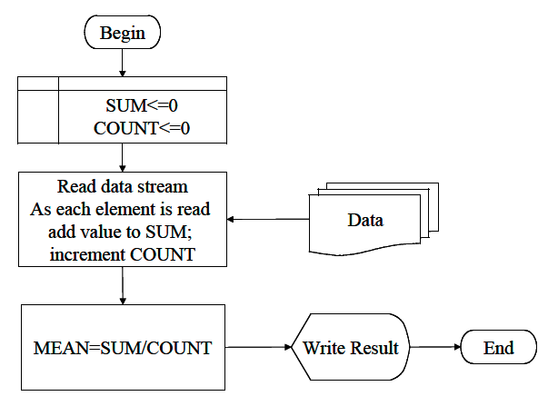

```python
%%html
<!-- Script Block to set tables to left alignment -->
<style>
  table {margin-left: 0 !important;}
</style>
```


<!-- Script Block to set tables to left alignment -->
<style>
  table {margin-left: 0 !important;}
</style>


# ENGR 1330 Computational Thinking with Data Science 
Last GitHub Commit Date: 13 January 2021
## Lesson 1 Problem Solving and Computational Thinking: 
- CT concepts
- Programming as a problem solving process
- CCMR Approach

### Special Script Blocks

In the lesson notebooks there will usually be two script blocks, identical to the ones below.  

- The first block identifies the particular computer, the user, and the python kernel in use.
- The second block sets markdown tables to left edge when rendering.

I usually put both blocks at the top of the notebook, just after some kind of title block, as done here.

## CT Foundations

CT is literally a process for breaking down a problem into smaller parts, looking for patterns in the problems, identifying what kind of information is needed, developing a step-by-step solution, and implementing that solution. 

1. Decomposition
2. Pattern Recognition
3. Abstraction
4. Algorithms
5. System Integration (implementation)

#### Decomposition
Decomposition is the process of taking a complex problem and breaking it into more manageable sub-problems. Decomposition leaves a **framework** of sub-problems that later have to be **assembled (system integration)** to produce a desired solution.
 
#### Pattern Recognition
Refers to finding similarities, or shared characteristics of problems.  Allows a complex problem to become easier to solve. Allows use of same solution method for each occurrence of the pattern. 

Pattern recognition allows use of **automation** to process things - its a fundamental drilled shaft of CT.  It also provides a way to use analogs from old problems to address new situations; it also will require **assembly (system integration)** to produce a desired solution.

#### Abstraction

Determine important characteristics of the problem and ignore characteristics that are not important. Use these characteristics to create a representation of what we are trying to solve. 

#### Algorithms
Step-by-step instructions of how to solve a problem (https://en.wikipedia.org/wiki/Algorithm). 
Identifies what is to be done, and the order in which they should be done.
An algorithm is a **finite** sequence of defined, instructions, typically to solve a class of problems or to perform a computation. 

#### System Integration (implementation)

System integration is the assembly of the parts above into the complete (integrated) solution.  Integration combines parts into a program which is the realization of an algorithm using a syntax that the computer can understand. 

## Programming as a problem solving process
The entire point of this course is to develop problem solving skills and begin using some tools (Statistics, Numerical Methods, Data Science, implemented as JupyterLab/Python programs).

The scientific method (https://en.wikipedia.org/wiki/Scientific_method) is one example of an effective problem solving strategy. Stated as a protocol it goes something like:

1. Observation: Formulation of a question
2. Hypothesis: A  conjecture that may explain observed behavior. Falsifiable by an experiment whose outcome conflicts with predictions deduced from the hypothesis
3. Prediction: How the experiment should conclude if hypothesis is correct 
4. Testing: Experimental design, and conduct of the experiment.
5. Analysis: Interpretation of experimental results
 
This protocol can be directly adapted to CT/DS problems as:

1. Define the problem (problem statement)
2. Gather information (identify known and unknown values, and governing equations)
- Input information
- Governing equations or principles, and 
- The required output information.
3. Generate and evaluate potential solutions
- Work a sample problem by-hand for testing the general solution.
4. Develop a general solution method (coding).
5. Test the general solution against the by-hand example, then apply to the real problem.

Oddly enough the first step is the most important and sometimes the most difficult. In a practical problem, step 2 is sometimes difficult because a skilled programmer is needed to translate the governing principles into an algorithm for the general solution (step 4).

### Example 1 Problem Solving Process

Consider a need to compute an arithmetic mean, what would the process look like?

**Step 1.** Develop script to compute the arithmetic mean of a stream of data of unknown length.

**Step 2.** 
  - Inputs: The data stream 
  - Governing equation: $ \bar x = \frac{1}{N} \sum_{i=1}^{N} x_i $ where $N$ is the number of items in the data stream, and $x_i$ is the value of the i-th element.
  - Outputs: The arithmetic mean $\bar x$

**Step 3.** Work a sample problem by-hand for testing the general solution.

|Data|
|---:|
|23.43|
|37.43|
|34.91|
|28.37|
|30.62|

The arithmetic mean requires us to count how many elements are in the data stream (in this case there are 5) and compute their sum (in this case 154.76), and finally divide the sum by the count and report this result as the arithmetic mean.

$$ \bar x = \frac{1}{5}(23.43+37.43+34.91+28.37+30.62)=\frac{154.76}{5}=30.95 $$

**Step 4.** Develop a general solution (code)

The by-hand exercise helps identify the required steps in an “algorithm” or recipe to compute mean values. First we essentially capture or read the values then count how many there are (either as we go or as a separate step), then sum the values, then divide the values by the count, and finally report the result.

In a flow-chart it would look like:



||Flowchart for Artihmetic Mean Algorithm||
|---|------------|---|

**Step 5.** This step we would code the algorithm expressed in the figure and test it with the by-hand data and other small datasets until we are convinced it works correctly.

In a simple JupyterLab script


```python
# Arithmetic Mean in Very Elementary and Primative Python
xlist = [23.43,37.43,34.91,28.37,30.62] # list is a type of data structure
howlong = len(xlist) # len is a built-in function that returns how many items in a list
accumulator = 0 # a variable to accumulate the sum
for i in range(howlong):
    accumulator = accumulator + xlist[i]
print("arithmetic mean = ",(accumulator/howlong))
```

    arithmetic mean =  30.951999999999998


**Step 6.** This step we would refine the code to generalize the algorithm.  In the example we want a way to supply the `xlist` from a file perhaps, and tidy the output by rounding to only two decimal places - rounding is relatively simple:


```python
# Arithmetic Mean in Very Elementary and Primative Python
xlist = [23.43,37.43,34.91,28.37,30.62] # list is a type of data structure
howlong = len(xlist) # len is a built-in function that returns how many items in a list
accumulator = 0 # a variable to accumulate the sum
for i in range(howlong):
    accumulator = accumulator + xlist[i]
print("arithmetic mean = ",round((accumulator/howlong),2))
```

    arithmetic mean =  30.95


Reading from a file, is a bit more complicated.  We need to create a connection to the file, then read the contents into our script, then put the contents into the `xlist`


```python
xlist=[] # list (null) is a type of data structure
externalfile = open("data.txt",'r') # create connection to file, set to read (r), file must exist
how_many_lines = 0
for line in externalfile: # parse each line, append to xlist
    xlist.append(line)
    how_many_lines += 1
externalfile.close() # close the file connection

howlong = len(xlist) # len is a built-in function that returns how many items in a list
accumulator = 0 # a variable to accumulate the sum
for i in range(howlong):
    accumulator = accumulator + float(xlist[i])
print("arithmetic mean = ",round((accumulator/howlong),2))
```

    arithmetic mean =  30.95


Finally, if we want to reuse the code a lot, it is convienent to make it into a function


```python
def average(inputlist):
# inputlist should be a list of values
    howlong = len(inputlist) # len is a built-in function that returns how many items in a list
    accumulator = 0 # a variable to accumulate the sum
    for i in range(howlong):
        accumulator = accumulator + float(inputlist[i])
    result = (accumulator/howlong)
    return(result)
```

Put our file reading and compute mean code here


```python
xlist=[] # list (null) is a type of data structure
externalfile = open("data.txt",'r') # create connection to file, set to read (r), file must exist
how_many_lines = 0
for line in externalfile: # parse each line, append to xlist
    xlist.append(line)
    how_many_lines += 1
externalfile.close() # close the file connection
print("arithmetic mean = ",round(average(xlist),2))
```

    arithmetic mean =  30.95


So the simple task of computing the mean of a collection of values, is a bit more complex when decomposed that it first appears, but illustrates a five step process (with a refinement step).  Throughout the course this process is always in the background.

## CCMR Approach

A lot of the problems we will encounter from a CT/DS perspective have already been solved, or at least analogs have been solved.  It is perfectly acceptable to use prior work for a new set of conditions as long as **proper attribution** is made.  We can give this process a simple acronym CCMR:

1. **Copy:** Find a solution to your problem from some online example:  SourceForge, StackOverflow, GeeksForGeeks, DigitalOcean, etc.
2. **Cite:** Cite the original source.  In general a citation will look like one of the references below, but a URL to the source is sufficient at first.
3. **Modify:** Modify the original cited work for your specific needs.  Note the changes in the code using comment statements.
4. **Run:** Apply the modified code to the problem of interest. 

In cases where we use CCMR we are not so much doing original programming as we are just scaffolding parts (https://en.wikipedia.org/wiki/Scaffold_(programming)) - a legitimate and valuable engineering activity.

## Readings

Computational and Inferential Thinking Ani Adhikari and John DeNero, Computational and Inferential Thinking, The Foundations of Data Science, Creative Commons Attribution-NonCommercial-NoDerivatives 4.0 International (CC BY-NC-ND) Chapter 1 https://www.inferentialthinking.com/chapters/01/what-is-data-science.html


```python
# Script block to identify host, user, and kernel
import sys
! hostname
! whoami
! pwd
print(sys.executable)
print(sys.version)
print(sys.version_info)
```

    atomickitty
    sensei
    /home/sensei/1330-textbook-webroot/docs/lesson0
    /opt/jupyterhub/bin/python3
    3.8.5 (default, Jul 28 2020, 12:59:40) 
    [GCC 9.3.0]
    sys.version_info(major=3, minor=8, micro=5, releaselevel='final', serial=0)

