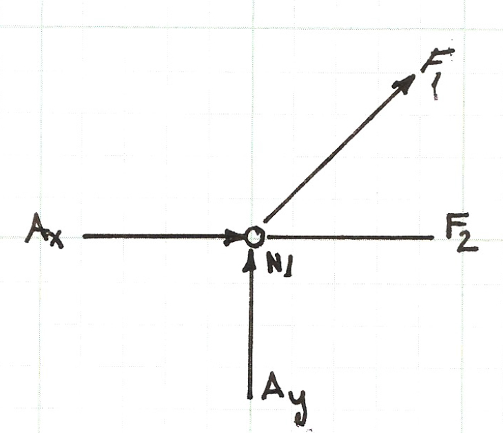
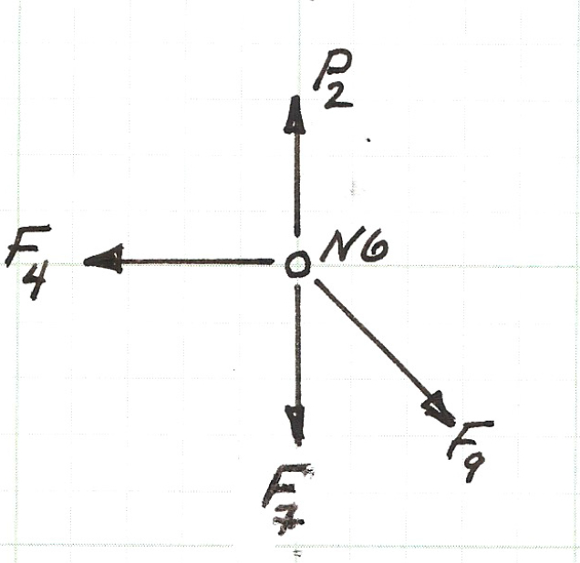

Copyright © 2021  Author, *all rights reserved*

# ENGR 1330 Computational Thinking with Data Science 
Last GitHub Commit Date: 

## Lesson 12 Linear Systems of Equations 

This lesson will 

---

## Objectives
- Construct multivariate linear equation systems
- Solve using a Gaussian Reduction method
- Demonstrate practical application with a 

## Matrix Arithmetic

Use Dannemiller's matrix notes or Cleveland's old notes.  Typeset to use typical Matrix-Vector forms.

### Scalar Multiply a Vector

### Vector Inner Product (Dot Product)

### Matrix Vector Product

### Matrix Matrix Product


### Matrix Inversion

In many practical computational and theoretical operations we employ the concept of the inverse of a matrix.
The inverse is somewhat analogous to "dividing" by the matrix.  
Consider our linear system:

$\begin{gather}
\mathbf{A} \cdot \mathbf{x} = \mathbf{b}
\end{gather}$

If we wished to solve for $\mathbf{x}$ we would "divide" both sides of the equation by $\mathbf{A}$.   

Instead of division (which is undefined for matrices) we instead multiply by the inverse of the matrix. The inverse of a matrix $\mathbf{A}$ is denoted by $\mathbf{A}^{-1}$ and is by definition a matrix such that when $\mathbf{A}^{-1}$ and $\mathbf{A}$ are multiplied together, the identity matrix $\mathbf{I}$ results.  e.g. $\mathbf{A}^{-1} \mathbf{A} = \mathbf{I}$

Lets consider the matrixes below
\begin{gather}
\mathbf{A}=
\begin{pmatrix}
2 & 3 \\
4 & -3 \\
\end{pmatrix}
\end{gather}

\begin{gather}
\mathbf{A}^{-1}=
\begin{pmatrix}
\frac{1}{6} & \frac{1}{6} \\
~\\
\frac{2}{9} & -\frac{1}{9} \\
\end{pmatrix}
\end{gather}

We can check that the matrices are indeed inverses of each other using our Python code.


```python
# multiplymatrix.py  -- Code to read and manipulate matrix
amatrix = [] # null list to store matrix reads
rowNumA = 0
colNumA = 0
######################################
# connect and read file for MATRIX A #
######################################
amatrix = [] # null list for reading file
afile = open("Amat.txt","r")
for line in afile:
    amatrix.append([float(n) for n in line.strip().split()])
    rowNumA += 1
afile.close() # Disconnect the file
######################################
# end file read ,disconnect file     #
######################################
colNumA = len(amatrix[0])
# print all columns each row
for i in range(0,rowNumA,1):
    print (amatrix[i][0:colNumA])
print ("-----------------------------")
bmatrix = [] # null list to store matrix reads
rowNumB = 0
colNumB = 0
######################################
# connect and read file for MATRIX B #
######################################
bmatrix = [] # null list for reading file
afile = open("Bmat.txt","r")
for line in afile:
    bmatrix.append([float(n) for n in line.strip().split()])
    rowNumB += 1
afile.close() # Disconnect the file
######################################
# end file read ,disconnect file     #
######################################
colNumB = len(bmatrix[0])
# print all columns each row
for i in range(0,rowNumB,1):
    print (bmatrix[i][0:colNumB])
print ("------------------------------")
##########################################################
### multiply the matrices, store result in result_matrix #
##########################################################
result_matrix = [[0 for j in range(colNumB)] for i in range(rowNumA)]
for i in range(0,rowNumA):
    for j in range(0,colNumB):
        for k in range(0,colNumA):
            result_matrix[i][j]=result_matrix[i][j]+amatrix[i][k]*bmatrix[k][j]
# observe the triple for-loop structure and the counting scheme
# print all cooumns each row
for i in range(0,rowNumA,1):
    print (result_matrix[i][0:colNumB])
```

    [2.0, 3.0]
    [4.0, -3.0]
    -----------------------------
    [0.1666667, 0.1666667]
    [0.2222222, -0.1111111]
    ------------------------------
    [1.0, 1.0000000000287557e-07]
    [2.0000000000575113e-07, 1.0000001]


The script above is our multiplication script modified to read the $\mathbf{A}$ and $\mathbf{A}^{-1}$  perform the multiplication and then report the result. 

Now that we have some background on what an inverse is, it would be nice to know how to find them --- that is a remarkably challenging problem.   Here we examine a classical algorithm for finding an inverse if we really need to --- computationally we only invert if necessary, there are other ways to "divide" that are faster.

### Gauss-Jordan method of finding $\mathbf{A}^{-1}$

There are a number of methods that can be used to find the inverse of a matrix using elementary row operations.  
An elementary row operation is any one of the three operations listed below:


        1. Multiply or divide an entire row by a constant
        2. Add or subtract a multiple of one row to/from another
        3. Exchange the position of any 2 rows


The Gauss-Jordan method of inverting a matrix can be divided into 4 main steps. 

In order to find the inverse we will be working with the original matrix, augmented with the identity matrix -- this new matrix is called the augmented matrix (because no-one has tried to think of a cooler name yet).  

\begin{gather}
\mathbf{A} | \mathbf{I} =
\begin{pmatrix}
2 & 3 & | & 1 & 0 \\
4 & -3 & | & 0 & 1 \\
\end{pmatrix}
\end{gather}

We will perform elementary row operations based on the left matrix to convert it to an identity matrix -- we perform the same operations on the right matrix and the result when we are done is the inverse of the original matrix.

So here goes -- in the theory here, we also get to do infinite-precision arithmetic, no rounding/truncation errors.  

1) Divide row one by the $a_{1,1}$ value to force a $1$ in the $a_{1,1}$ position.   This is elementary row operation 1 in our list above.
\begin{gather}
\mathbf{A} | \mathbf{I} =
\begin{pmatrix}
2/2 & 3/2 & | & 1/2 & 0 \\
4 & -3 & | & 0 & 1 \\
\end{pmatrix}
=
\begin{pmatrix}
1 & 3/2 & | & 1/2 & 0 \\
4 & -3 & | & 0 & 1 \\
\end{pmatrix}
\end{gather}

2) For all rows below the first row, replace $row_j$ with $row_j - a_{j,1}*row_1$.  
This happens to be elementary row operation 2 in our list above.
\begin{gather}
\mathbf{A} | \mathbf{I} =
\begin{pmatrix}
1 & 3/2 & | & 1/2 & 0 \\
4 - 4(1) & -3 - 4(3/2) & | & 0-4(1/2) & 1-4(0) \\
\end{pmatrix}
=
\begin{pmatrix}
1 & 3/2 & | & 1/2 & 0 \\
0 & -9 & | & -2 & 1 \\
\end{pmatrix}
\end{gather}


3) Now multiply $row_2$ by $ \frac{1}{ a_{2,2}} $.  This is again elementary row operation 1 in our list above.

\begin{gather}
\mathbf{A} | \mathbf{I} =
\begin{pmatrix}
1 & 3/2 & | & 1/2 & 0 \\
0 & -9/-9 & | & -2/-9 & 1/-9 \\
\end{pmatrix}
=
\begin{pmatrix}
1 & 3/2 & | & 1/2 & 0 \\
0 & 1 & | & 2/9 & -1/9 \\
\end{pmatrix}
\end{gather}

4) For all rows above and below this current row, replace $row_j$ with $row_j - a_{2,2}*row_2$.  
This happens to again be elementary row operation 2 in our list above.  
What we are doing is systematically converting the left matrix into an identity matrix by multiplication of constants and addition to eliminate off-diagonal values and force 1 on the diagonal.

\begin{gather}
\mathbf{A} | \mathbf{I} = \\
\begin{pmatrix}
1 & 3/2 - (3/2)(1) & | & 1/2 - (3/2)(2/9) & 0-(3/2)(-1/9) \\
0 & 1 & | & 2/9 & -1/9 \\
\end{pmatrix}
= \\
\begin{pmatrix}
1 & 0 & | & 1/6 & 1/6 \\
0 & 1 & | & 2/9 & -1/9 \\
\end{pmatrix}
\end{gather}

5) As far as this example is concerned we are done and have found the inverse.  
With more than a 2X2 system there will be many operations moving up and down the matrix to eliminate the off-diagonal terms.


```python

```


```python

```


```python

```


```python
# InvertASystem.py
# Code to read A and b
# Then solve Ax = b for x by Gaussian elimination with back substitution
#
print ("invert a matrix")
print ("wrapper loop -- OK")
print ("run wrapper through two iterations, same inputs")
print ("added xmatrix,bmatrix -- get same result ")
print ("suppress vector only calcs")
print ("clean up output")
amatrix = [] # null list to store matrix reads
bvector = []
rowNumA = 0
colNumA = 0
rowNumB = 0
######################################
# connect and read file for MATRIX A #
######################################
afile = open("A.txt","r")
for line in afile:
    amatrix.append([float(n) for n in line.strip().split()])
    rowNumA += 1
afile.close() # Disconnect the file
######################################
# end file read ,disconnect file     #
######################################
colNumA = len(amatrix[0])
afile = open("B.txt","r")
for line in afile:
    bvector.append(float(line))  # vector read different -- just float the line
    rowNumB += 1
afile.close() # Disconnect the file
print (bvector)
# check the arrays
if rowNumA != rowNumB:
    print ("row ranks not same -- aborting now")
    quit()
else:
    print ("row ranks same -- continuing operation")
# print all columns each row
cmatrix = [[0 for j in range(colNumA)]for i in range(rowNumA)]
dmatrix = [[0 for j in range(colNumA)]for i in range(rowNumA)]
bmatrix = [[0 for j in range(colNumA)]for i in range(rowNumA)]
xmatrix = [[0 for j in range(colNumA)]for i in range(rowNumA)]
xvector = [0 for i in range(rowNumA)]
for i in range(0,rowNumA,1):
    print (amatrix[i][0:colNumA], cmatrix[i][0:colNumA])
    bmatrix[i][i] = 1.0
print ("-----------------------------")
# copy amatrix into dmatrix  -- this is a static copy
dmatrix = [[amatrix[i][j] for j in range(colNumA)]for i in range(rowNumA)]
# now attempt invert

#
# outer wrapper loop
#
for jcol in range(rowNumA):
#    print "run ",jcol
    xvector = [0 for i in range(rowNumA)]
#    xmatrix = [[0 for j in range(colNumA)]for i in range(rowNumA)]
    for i in range(rowNumA):
        bvector[i]=bmatrix[i][jcol]
    amatrix = [[dmatrix[i][j] for j in range(colNumA)]for i in range(rowNumA)]
    cmatrix = [[dmatrix[i][j] for j in range(colNumA)]for i in range(rowNumA)]
    print ("reset A matrix, x vector, b vector")
    for i in range(0,rowNumA,1):
        print (amatrix[i][0:colNumA],xvector[i],bvector[i]) 
    print ("-----------------------------")
# build the diagonal -- assume diagonally dominant
    for k in range(rowNumA-1):
        l = k+1
        for i in range(l,rowNumA):
            for j in range(colNumA):
                cmatrix[i][j]=amatrix[i][j]-amatrix[k][j]*amatrix[i][k]/amatrix[k][k]
            bvector[i] = bvector[i]-bvector[k]*amatrix[i][k]/amatrix[k][k]
            bmatrix[i][jcol] = bmatrix[i][jcol]-bmatrix[k][jcol]*amatrix[i][k]/amatrix[k][k]
        for i in range(rowNumA):
            for j in range(colNumA):
                amatrix[i][j] = cmatrix[i][j]
# gaussian reduction done
# now for the back substitution
    for i in range(0,rowNumA,1):
        print (amatrix[i][0:colNumA], bvector[i],cmatrix[i][0:colNumA])
    print ("-----------------------------")
    for k in range(rowNumA-1,-1,-1):
        sum = 0.0
        sum1 = 0.0
        for i in range(rowNumA):
            if i == k:
                continue 
            else:
                sum = sum + amatrix[k][i]*xvector[i]
                sum1 = sum1 + amatrix[k][i]*xmatrix[i][jcol]
            xvector[k]=(bvector[k]-sum)/amatrix[k][k]
            xmatrix[k][jcol]=(bmatrix[k][jcol]-sum1)/amatrix[k][k]
    for i in range(0,rowNumA,1):
        print (dmatrix[i][0:colNumA],xvector[i],bvector[i]) 
    print ("-----------------------------")
    for i in range(0,rowNumA,1):
        print (dmatrix[i][0:colNumA],xmatrix[i][jcol],bmatrix[i][jcol]) 
    print ("-----------------------------")
# end of wrapper
print ("[      A-Matrix          ]|[       A-Inverse        ]")
print ("_____________________________________________________")
for i in range(0,rowNumA,1):
    print (dmatrix[i][0:colNumA],"|", xmatrix[i][0:colNumA])
print ("_____________________________________________________")
ofile = open("A-Matrix.txt","w") # "w" clobbers content already there!
for i in range(0,rowNumA,1):
    message = '  '.join(map(repr, dmatrix[i][0:colNumA])) + "\n" 
    ofile.write(message)
ofile.close()
ofile = open("A-Inverse.txt","w") # "w" clobbers content already there!
for i in range(0,rowNumA,1):
    message = '  '.join(map(repr, xmatrix[i][0:colNumA])) + "\n"
    ofile.write(message)
ofile.close()


```

    invert a matrix
    wrapper loop -- OK
    run wrapper through two iterations, same inputs
    added xmatrix,bmatrix -- get same result 
    suppress vector only calcs
    clean up output
    [5.0, 6.0, 7.0, 8.0, 9.0]
    row ranks same -- continuing operation
    [4.0, 1.5, 0.7, 1.2, 0.5] [0, 0, 0, 0, 0]
    [1.0, 6.0, 0.9, 1.4, 0.7] [0, 0, 0, 0, 0]
    [0.5, 1.0, 3.9, 3.2, 0.9] [0, 0, 0, 0, 0]
    [0.2, 2.0, 0.2, 7.5, 1.9] [0, 0, 0, 0, 0]
    [1.7, 0.9, 1.2, 2.3, 4.9] [0, 0, 0, 0, 0]
    -----------------------------
    reset A matrix, x vector, b vector
    [4.0, 1.5, 0.7, 1.2, 0.5] 0 1.0
    [1.0, 6.0, 0.9, 1.4, 0.7] 0 0
    [0.5, 1.0, 3.9, 3.2, 0.9] 0 0
    [0.2, 2.0, 0.2, 7.5, 1.9] 0 0
    [1.7, 0.9, 1.2, 2.3, 4.9] 0 0
    -----------------------------
    [4.0, 1.5, 0.7, 1.2, 0.5] 1.0 [4.0, 1.5, 0.7, 1.2, 0.5]
    [0.0, 5.625, 0.7250000000000001, 1.0999999999999999, 0.575] -0.25 [0.0, 5.625, 0.7250000000000001, 1.0999999999999999, 0.575]
    [0.0, 0.0, 3.707777777777778, 2.8911111111111114, 0.7544444444444445] -0.08888888888888889 [0.0, 0.0, 3.707777777777778, 2.8911111111111114, 0.7544444444444445]
    [0.0, 0.0, 0.0, 7.128360803116572, 1.6951333533113575] 0.03356308061132753 [0.0, 0.0, 0.0, 7.128360803116572, 1.6951333533113575]
    [0.0, 0.0, 0.0, 0.0, 4.231527930403315] -0.3975053957273071 [0.0, 0.0, 0.0, 0.0, 4.231527930403315]
    -----------------------------
    [4.0, 1.5, 0.7, 1.2, 0.5] 0.27196423630168165 1.0
    [1.0, 6.0, 0.9, 1.4, 0.7] -0.036786468827077756 -0.25
    [0.5, 1.0, 3.9, 3.2, 0.9] -0.025949127789423248 -0.08888888888888889
    [0.2, 2.0, 0.2, 7.5, 1.9] 0.027047195749338872 0.03356308061132753
    [1.7, 0.9, 1.2, 2.3, 4.9] -0.0939389748254409 -0.3975053957273071
    -----------------------------
    [4.0, 1.5, 0.7, 1.2, 0.5] 0.27196423630168165 1.0
    [1.0, 6.0, 0.9, 1.4, 0.7] -0.036786468827077756 -0.25
    [0.5, 1.0, 3.9, 3.2, 0.9] -0.025949127789423248 -0.08888888888888889
    [0.2, 2.0, 0.2, 7.5, 1.9] 0.027047195749338872 0.03356308061132753
    [1.7, 0.9, 1.2, 2.3, 4.9] -0.0939389748254409 -0.3975053957273071
    -----------------------------
    reset A matrix, x vector, b vector
    [4.0, 1.5, 0.7, 1.2, 0.5] 0 0
    [1.0, 6.0, 0.9, 1.4, 0.7] 0 1.0
    [0.5, 1.0, 3.9, 3.2, 0.9] 0 0
    [0.2, 2.0, 0.2, 7.5, 1.9] 0 0
    [1.7, 0.9, 1.2, 2.3, 4.9] 0 0
    -----------------------------
    [4.0, 1.5, 0.7, 1.2, 0.5] 0 [4.0, 1.5, 0.7, 1.2, 0.5]
    [0.0, 5.625, 0.7250000000000001, 1.0999999999999999, 0.575] 1.0 [0.0, 5.625, 0.7250000000000001, 1.0999999999999999, 0.575]
    [0.0, 0.0, 3.707777777777778, 2.8911111111111114, 0.7544444444444445] -0.14444444444444443 [0.0, 0.0, 3.707777777777778, 2.8911111111111114, 0.7544444444444445]
    [0.0, 0.0, 0.0, 7.128360803116572, 1.6951333533113575] -0.3454599940065927 [0.0, 0.0, 0.0, 7.128360803116572, 1.6951333533113575]
    [0.0, 0.0, 0.0, 0.0, 4.231527930403315] 0.03860910887892463 [0.0, 0.0, 0.0, 0.0, 4.231527930403315]
    -----------------------------
    [4.0, 1.5, 0.7, 1.2, 0.5] -0.05581183146290884 0
    [1.0, 6.0, 0.9, 1.4, 0.7] 0.18691841183385363 1.0
    [0.5, 1.0, 3.9, 3.2, 0.9] -0.0013334022990376664 -0.14444444444444443
    [0.2, 2.0, 0.2, 7.5, 1.9] -0.05063248905238324 -0.3454599940065927
    [1.7, 0.9, 1.2, 2.3, 4.9] 0.009124153146082323 0.03860910887892463
    -----------------------------
    [4.0, 1.5, 0.7, 1.2, 0.5] -0.05581183146290884 0
    [1.0, 6.0, 0.9, 1.4, 0.7] 0.18691841183385363 1.0
    [0.5, 1.0, 3.9, 3.2, 0.9] -0.0013334022990376664 -0.14444444444444443
    [0.2, 2.0, 0.2, 7.5, 1.9] -0.05063248905238324 -0.3454599940065927
    [1.7, 0.9, 1.2, 2.3, 4.9] 0.009124153146082323 0.03860910887892463
    -----------------------------
    reset A matrix, x vector, b vector
    [4.0, 1.5, 0.7, 1.2, 0.5] 0 0
    [1.0, 6.0, 0.9, 1.4, 0.7] 0 0
    [0.5, 1.0, 3.9, 3.2, 0.9] 0 1.0
    [0.2, 2.0, 0.2, 7.5, 1.9] 0 0
    [1.7, 0.9, 1.2, 2.3, 4.9] 0 0
    -----------------------------
    [4.0, 1.5, 0.7, 1.2, 0.5] 0 [4.0, 1.5, 0.7, 1.2, 0.5]
    [0.0, 5.625, 0.7250000000000001, 1.0999999999999999, 0.575] 0.0 [0.0, 5.625, 0.7250000000000001, 1.0999999999999999, 0.575]
    [0.0, 0.0, 3.707777777777778, 2.8911111111111114, 0.7544444444444445] 1.0 [0.0, 0.0, 3.707777777777778, 2.8911111111111114, 0.7544444444444445]
    [0.0, 0.0, 0.0, 7.128360803116572, 1.6951333533113575] 0.022415343122565184 [0.0, 0.0, 0.0, 7.128360803116572, 1.6951333533113575]
    [0.0, 0.0, 0.0, 0.0, 4.231527930403315] -0.23761967500359435 [0.0, 0.0, 0.0, 0.0, 4.231527930403315]
    -----------------------------
    [4.0, 1.5, 0.7, 1.2, 0.5] -0.032853102922602934 0
    [1.0, 6.0, 0.9, 1.4, 0.7] -0.032062455842026744 0.0
    [0.5, 1.0, 3.9, 3.2, 0.9] 0.26826513178341493 1.0
    [0.2, 2.0, 0.2, 7.5, 1.9] 0.01649816113355711 0.022415343122565184
    [1.7, 0.9, 1.2, 2.3, 4.9] -0.05615458031041434 -0.23761967500359435
    -----------------------------
    [4.0, 1.5, 0.7, 1.2, 0.5] -0.032853102922602934 0
    [1.0, 6.0, 0.9, 1.4, 0.7] -0.032062455842026744 0.0
    [0.5, 1.0, 3.9, 3.2, 0.9] 0.26826513178341493 1.0
    [0.2, 2.0, 0.2, 7.5, 1.9] 0.01649816113355711 0.022415343122565184
    [1.7, 0.9, 1.2, 2.3, 4.9] -0.05615458031041434 -0.23761967500359435
    -----------------------------
    reset A matrix, x vector, b vector
    [4.0, 1.5, 0.7, 1.2, 0.5] 0 0
    [1.0, 6.0, 0.9, 1.4, 0.7] 0 0
    [0.5, 1.0, 3.9, 3.2, 0.9] 0 0
    [0.2, 2.0, 0.2, 7.5, 1.9] 0 1.0
    [1.7, 0.9, 1.2, 2.3, 4.9] 0 0
    -----------------------------
    [4.0, 1.5, 0.7, 1.2, 0.5] 0 [4.0, 1.5, 0.7, 1.2, 0.5]
    [0.0, 5.625, 0.7250000000000001, 1.0999999999999999, 0.575] 0.0 [0.0, 5.625, 0.7250000000000001, 1.0999999999999999, 0.575]
    [0.0, 0.0, 3.707777777777778, 2.8911111111111114, 0.7544444444444445] 0.0 [0.0, 0.0, 3.707777777777778, 2.8911111111111114, 0.7544444444444445]
    [0.0, 0.0, 0.0, 7.128360803116572, 1.6951333533113575] 1.0 [0.0, 0.0, 0.0, 7.128360803116572, 1.6951333533113575]
    [0.0, 0.0, 0.0, 0.0, 4.231527930403315] -0.1488884423394965 [0.0, 0.0, 0.0, 0.0, 4.231527930403315]
    -----------------------------
    [4.0, 1.5, 0.7, 1.2, 0.5] -0.016869919448735553 0
    [1.0, 6.0, 0.9, 1.4, 0.7] -0.011456196435011407 0.0
    [0.5, 1.0, 3.9, 3.2, 0.9] -0.10875073215127727 0.0
    [0.2, 2.0, 0.2, 7.5, 1.9] 0.1486518640705042 1.0
    [1.7, 0.9, 1.2, 2.3, 4.9] -0.03518550386250331 -0.1488884423394965
    -----------------------------
    [4.0, 1.5, 0.7, 1.2, 0.5] -0.016869919448735553 0
    [1.0, 6.0, 0.9, 1.4, 0.7] -0.011456196435011407 0.0
    [0.5, 1.0, 3.9, 3.2, 0.9] -0.10875073215127727 0.0
    [0.2, 2.0, 0.2, 7.5, 1.9] 0.1486518640705042 1.0
    [1.7, 0.9, 1.2, 2.3, 4.9] -0.03518550386250331 -0.1488884423394965
    -----------------------------
    reset A matrix, x vector, b vector
    [4.0, 1.5, 0.7, 1.2, 0.5] 0 0
    [1.0, 6.0, 0.9, 1.4, 0.7] 0 0
    [0.5, 1.0, 3.9, 3.2, 0.9] 0 0
    [0.2, 2.0, 0.2, 7.5, 1.9] 0 0
    [1.7, 0.9, 1.2, 2.3, 4.9] 0 1.0
    -----------------------------
    [4.0, 1.5, 0.7, 1.2, 0.5] 0 [4.0, 1.5, 0.7, 1.2, 0.5]
    [0.0, 5.625, 0.7250000000000001, 1.0999999999999999, 0.575] 0.0 [0.0, 5.625, 0.7250000000000001, 1.0999999999999999, 0.575]
    [0.0, 0.0, 3.707777777777778, 2.8911111111111114, 0.7544444444444445] 0.0 [0.0, 0.0, 3.707777777777778, 2.8911111111111114, 0.7544444444444445]
    [0.0, 0.0, 0.0, 7.128360803116572, 1.6951333533113575] 0.0 [0.0, 0.0, 0.0, 7.128360803116572, 1.6951333533113575]
    [0.0, 0.0, 0.0, 0.0, 4.231527930403315] 1.0 [0.0, 0.0, 0.0, 0.0, 4.231527930403315]
    -----------------------------
    [4.0, 1.5, 0.7, 1.2, 0.5] -0.0072026931722172435 0
    [1.0, 6.0, 0.9, 1.4, 0.7] -0.012617687833839365 0.0
    [0.5, 1.0, 3.9, 3.2, 0.9] -0.004266180002777282 0.0
    [0.2, 2.0, 0.2, 7.5, 1.9] -0.05619749842697155 0.0
    [1.7, 0.9, 1.2, 2.3, 4.9] 0.23632125710787594 1.0
    -----------------------------
    [4.0, 1.5, 0.7, 1.2, 0.5] -0.0072026931722172435 0
    [1.0, 6.0, 0.9, 1.4, 0.7] -0.012617687833839365 0.0
    [0.5, 1.0, 3.9, 3.2, 0.9] -0.004266180002777282 0.0
    [0.2, 2.0, 0.2, 7.5, 1.9] -0.05619749842697155 0.0
    [1.7, 0.9, 1.2, 2.3, 4.9] 0.23632125710787594 1.0
    -----------------------------
    [      A-Matrix          ]|[       A-Inverse        ]
    _____________________________________________________
    [4.0, 1.5, 0.7, 1.2, 0.5] | [0.27196423630168165, -0.05581183146290884, -0.032853102922602934, -0.016869919448735553, -0.0072026931722172435]
    [1.0, 6.0, 0.9, 1.4, 0.7] | [-0.036786468827077756, 0.18691841183385363, -0.032062455842026744, -0.011456196435011407, -0.012617687833839365]
    [0.5, 1.0, 3.9, 3.2, 0.9] | [-0.025949127789423248, -0.0013334022990376664, 0.26826513178341493, -0.10875073215127727, -0.004266180002777282]
    [0.2, 2.0, 0.2, 7.5, 1.9] | [0.027047195749338872, -0.05063248905238324, 0.01649816113355711, 0.1486518640705042, -0.05619749842697155]
    [1.7, 0.9, 1.2, 2.3, 4.9] | [-0.0939389748254409, 0.009124153146082323, -0.05615458031041434, -0.03518550386250331, 0.23632125710787594]
    _____________________________________________________


```python
print (amatrix)
```

    [[4.0, 1.5, 0.7, 1.2, 0.5], [0.0, 5.625, 0.7250000000000001, 1.0999999999999999, 0.575], [0.0, 0.0, 3.707777777777778, 2.8911111111111114, 0.7544444444444445], [0.0, 0.0, 0.0, 7.128360803116572, 1.6951333533113575], [0.0, 0.0, 0.0, 0.0, 4.231527930403315]]


```python

```

## Supply Code with Pivoting

## Supply numpy code

## Do a couple examples


```python

```

## Practical Application of Linear Solvers

A typical static truss analysis problem goes like 
    
    "The figure below is a simply supported, statically determinate truss with pin connections (zero moment transfer connections).   Find the forces in each member for the loading shown."


This notebook will illustrate how to leverage our linear systems solver(s) to analyze the truss.  The approach uses concepts from statics and computational thinking.

From statics

    1) method of joints (for reactions and internal forcez)
    2) direction cosines 
    
From computational thinking

    1) read input file
    2) construct linear system \textbf{Ax=b}; solve for \textbf{x}
    3) report results
    


Before even contemplating writing/using a program we need to build a mathematical model of the truss and assemble the system of linear equations that result from the model.  

So the first step is to sketch a free-body-diagram as below and build a node naming convention and force names.


Next we will write the force balance for each of the six nodes ($N1$-$N6$), which will produce a total of 12 equations in the 12 unknowns (the 9 member forces, and 3 reactions).


The figure below is the force balance for node $N1$, the two force equations (for the horizontal, $x$, direction and the vertical, $y$, direction) are listed below the figure.



\begin{gather}
\begin{matrix}
\sum F_x = 0 = & +F_1cos(45) & + F_2 &  &  &  &  &  &  & + A_x &  &  & & & \\
\sum F_y = 0 = & +F_1sin(45) &  & &  &  &  &  &  &  &  & + A_y &  &  & \\
\end{matrix}
\end{gather}

The equation above is the force balance equation pair for the node.  The $x$ component equation will later be named $N1_x$ to indicate it arises from Node 1, $x$ component equation.   A similar notation convention will also be adopted for the $y$ component equation.  There will be an equation pair for each node.


Below is a sketch of the force balance for node $N2$, the two force equations (for the horizontal, $x$, direction and the vertical, $y$, direction) are listed below the figure.


\begin{gather}
\begin{matrix}
\sum F_x = 0 = &  & -F_2 &  &  &  & +F_6 &  &  &  &  &  &  & & \\
\sum F_y = 0 =  &  &  & +F_3 &  &  &  &  &  &  &  &  &  & & \\
\end{matrix}
\end{gather}

Below is a sketch of the force balance for node $N3$, the two force equations (for the horizontal, $x$, direction and the vertical, $y$, direction) are listed below the figure.


\begin{gather}
\begin{matrix}
\sum F_x = 0 = &  &  &  &  & -F_5cos(30) & -F_6 & & +F_8 &  &  &  &  &  & \\
\sum F_y = 0 =  &  &  &  &  & F_5sin(30) &  & +F_7 &  &  &  &  &  &  & -P_3\\
\end{matrix}
\end{gather}

Above is the force balance equation pair for node $N3$.

Below is a sketch of the force balance for node $N4$, the two force equations (for the horizontal, $x$, direction and the vertical, $y$, direction) are listed below the figure.


\begin{gather}
\begin{matrix}
\sum F_x = 0 = &  &  &  &  &  &  &  & -F_8 & -F_9cos(45) &  &  &  &  & \\
\sum F_y = 0 =  &  &  &  &  &  &  &  &  & F_9sin(45) &  &  & +B_y  &  & \\
\end{matrix}
\end{gather}

Above is the force balance equation pair for node $N4$.

Below is a sketch of the force balance for node $N5$, the two force equations (for the horizontal, $x$, direction and the vertical, $y$, direction) are listed below the figure.


\begin{gather}
\begin{matrix}
\sum F_x = 0 = & -F_1cos(45) &  &   & +F_4 & +F_5cos(30) &  &  &  &  &  &  &  &  & \\
\sum F_y = 0 =  & -F_1sin(45) &  & -F_3 &   & -F_5sin(30) &  &  &  &  &  &  &  &  & -P_1\\
\end{matrix}
\end{gather}

Above is the force balance equation pair for node $N5$.

Below is a sketch of the force balance for node $N6$, the two force equations (for the horizontal, $x$, direction and the vertical, $y$, direction) are listed below the figure.



\begin{gather}
\begin{matrix}
\sum F_x = 0 = &  &  &  & -F_4 &  &  &  &  & F_9sin(45) &  &  &  &  & \\
\sum F_y = 0 =  &  &  &  &  &  &  & -F_7 &  & -F_9cos(45) &  &  &  &  & P_2\\
\end{matrix}
\end{gather}

Above is the force balance equation pair for node $N6$.

The next step is to gather the equation pairs into a system of linear equations.   
We will move the known loads to the right hand side and essentially construct the matrix equation $\mathbf{A}\mathbf{x} = \mathbf{b}$.   

The system below is a matrix representation of the equation pairs with the forces moved to the right hand side $\mathbf{b} = RHS$. 

\begin{gather}
\begin{pmatrix}
~ & F_1 & F_2 & F_3 & F_4 & F_5 & F_6 & F_7 & F_8 & F_9 & A_x & A_y & B_y & | & RHS\\
\hline
N1_x & 0.707 & 1 & 0 & 0 & 0 & 0 & 0 & 0 & 0 & 1 & 0 & 0 & | & 0\\
N1_y & 0.707 & 0 & 0 & 0 & 0 & 0 & 0 & 0 & 0 & 0 & 1 & 0 & | & 0\\
N2_x & 0 & -1 & 0 & 0 & 0 & 1 & 0 & 0 & 0 & 0 & 0 & 0 & | & 0\\
N2_y & 0 & 0 & 1 & 0 & 0 & 0 & 0 & 0 & 0 & 0 & 0 & 0 & | & 0\\
N3_x & 0 & 0 & 0 & 0 & -0.866 & -1 & 0 & 1 & 0 & 0 & 0 & 0 & | & 0\\
N3_y & 0 & 0 & 0 & 0 & 0.5 & 0 & 1 & 0 & 0 & 0 & 0 & 0 & | & P_3\\
N4_x & 0 & 0 & 0 & 0 & 0 & 0 & 0 & -1 & -0.707 & 0 & 0 & 0 & | & 0\\
N4_y & 0 & 0 & 0 & 0 & 0 & 0 & 0 & 0 & 0.707 & 0 & 0 & 0 & | & 0\\
N5_x & -0.707 & 0 & 0 & 1 & 0.866 & 0 & 0 & 0 & 0 & 0 & 0 & 0 & | & 0\\
N5_y & -0.707 & 0 & -1 & 0 & -0.5 & 0 & 0 & 0 & 0 & 0 & 0 & 0 & | & P_1\\
N6_x & 0 & 0 & 0 & -1 & 0 & 0 & 0 & 0 & 0.707 & 0 & 0 & 0 & | & 0\\
N6_y & 0 & 0 & 0 & 0 & 0 & 0 & -1 & 0 & -0.707 & 0 & 0 &  0 & | & -P_2\\
\end{pmatrix}
\end{gather}

In the system, the rows are labeled on the left-most column with their node-related equation name.   
Thus each row of the matrix corresponds to an equation derived from a node.   
The columns are labeled with their respective unknown force (except the last column, which represents the right-hand-side of the system of linear equations).  
Thus the coefficient in each column corresponds to a force in each node equation.   
The sign of the coefficient refers to the assumed direction the force acts.   

In the analysis all the members were assumed to be in tension (except for the reaction forces).   
If a coefficient has a value of zero in a particular row, then that force does no act at the node to which the row corresponds.    

From this representation the transition to the formal vector-matrix representation is straightforward. 

\begin{gather}
\mathbf{A} =
\begin{pmatrix}
0.707 & 1 & 0 & 0 & 0 & 0 & 0 & 0 & 0 & 1 & 0 & 0 \\
0.707 & 0 & 0 & 0 & 0 & 0 & 0 & 0 & 0 & 0 & 1 & 0 \\
0 & -1 & 0 & 0 & 0 & 1 & 0 & 0 & 0 & 0 & 0 & 0 \\
0 & 0 & 1 & 0 & 0 & 0 & 0 & 0 & 0 & 0 & 0 & 0 \\
0 & 0 & 0 & 0 & -0.866 & -1 & 0 & 1 & 0 & 0 & 0 & 0 \\
0 & 0 & 0 & 0 & 0.5 & 0 & 1 & 0 & 0 & 0 & 0 & 0 \\
0 & 0 & 0 & 0 & 0 & 0 & 0 & -1 & -0.707 & 0 & 0 & 0 \\
0 & 0 & 0 & 0 & 0 & 0 & 0 & 0 & 0.707 & 0 & 0 & 0 \\
-0.707 & 0 & 0 & 1 & 0.866 & 0 & 0 & 0 & 0 & 0 & 0 & 0 \\
-0.707 & 0 & -1 & 0 & -0.5 & 0 & 0 & 0 & 0 & 0 & 0 & 0 \\
0 & 0 & 0 & -1 & 0 & 0 & 0 & 0 & 0.707 & 0 & 0 & 0 \\
0 & 0 & 0 & 0 & 0 & 0 & -1 & 0 & -0.707 & 0 & 0 &  0 \\
\end{pmatrix}
\end{gather}

\begin{gather}
\mathbf{x} =
\begin{pmatrix}
F_1\\
F_2\\
F_3\\
F_4\\
F_5\\
F_6\\
F_7\\
F_8\\
F_9\\
A_x\\
A_y\\
B_y\\
\end{pmatrix}
\end{gather}

\begin{gather}
\mathbf{b} =
\begin{pmatrix}
0\\
0\\
0\\
0\\
0\\
P_3\\
0\\
0\\
0\\
P_1\\
0\\
-P_2\\
\end{pmatrix}
\end{gather}

The various matrices above are entere into text files named A.txt and B.txt, we can examine the file contents using the host OS as below


```python
# list contents of the A matrix, uses call to OS host
!(cat A.txt)
```

    4.0  1.5  0.7  1.2  0.5
    1.0  6.0  0.9  1.4  0.7
    0.5  1.0  3.9  3.2  0.9
    0.2  2.0  0.2  7.5  1.9
    1.7  0.9  1.2  2.3  4.9


```python
# list contents of RHS or b vector
!(cat B.txt)
```

    5.0
    6.0
    7.0
    8.0
    9.0


Now we use our solver tools, here I have not doen much on tidy output, thats left for the reader.


```python
# Linear System Solver

from LinearSolverPivot import linearsolver

amatrix = [] # null list to store matrix reads
bvector = []
rowNumA = 0
colNumA = 0
rowNumB = 0
afile = open("A.txt","r")  # connect and read file for MATRIX A 
for line in afile:
    amatrix.append([float(n) for n in line.strip().split()])
    rowNumA += 1
afile.close() # Disconnect the file
colNumA = len(amatrix[0])
afile = open("B.txt","r")  # connect and read file for MATRIX B 
for line in afile:
    bvector.append(float(line))  # vector read different -- just float the line
    rowNumB += 1
afile.close() # Disconnect the file
#print (bvector)
if rowNumA != rowNumB:   # check the arrays
    print ("row ranks not same -- aborting now")
    quit()
else:
    print ("row ranks same -- continuing operation")
# print all columns each row
cmatrix = [[0 for j in range(colNumA)]for i in range(rowNumA)]
dmatrix = [[0 for j in range(colNumA)]for i in range(rowNumA)]
xvector = [0 for i in range(rowNumA)]
dvector = [0 for i in range(rowNumA)]
for i in range(0,rowNumA,1):
    print (amatrix[i][0:colNumA], bvector[i])
print ("-----------------------------")
# copy amatrix into cmatrix
cmatrix = [[amatrix[i][j] for j in range(colNumA)]for i in range(rowNumA)]
dmatrix = [[amatrix[i][j] for j in range(colNumA)]for i in range(rowNumA)]
dvector = [bvector[i] for i in range(rowNumA)]
dvector = linearsolver(amatrix,bvector)
for i in range(0,rowNumA,1):
    print (dvector[i])
print ("-----------------------------")
```

    row ranks same -- continuing operation
    [4.0, 1.5, 0.7, 1.2, 0.5] 5.0
    [1.0, 6.0, 0.9, 1.4, 0.7] 6.0
    [0.5, 1.0, 3.9, 3.2, 0.9] 7.0
    [0.2, 2.0, 0.2, 7.5, 1.9] 8.0
    [1.7, 0.9, 1.2, 2.3, 4.9] 9.0
    -----------------------------
    0.5951948781328953
    0.5079321739889
    0.831708392507349
    0.6303655990885844
    1.0373752656472461
    -----------------------------


## References
Overland, B. (2018). Python Without Fear. Addison-Wesley 
ISBN 978-0-13-468747-6. 

Grus, Joel (2015). Data Science from Scratch: First Principles with Python O’Reilly
Media. Kindle Edition.

Precord, C. (2010) wxPython 2.8 Application Development Cookbook Packt Publishing Ltd. Birmingham , B27 6PA, UK 
ISBN 978-1-849511-78-0.


```python
import numpy as np

amatrix = [] # null list to store matrix reads
bvector = []
rowNumA = 0
colNumA = 0
rowNumB = 0
afile = open("A.txt","r")  # connect and read file for MATRIX A 
for line in afile:
    amatrix.append([float(n) for n in line.strip().split()])
    rowNumA += 1
afile.close() # Disconnect the file
afile = open("B.txt","r")  # connect and read file for MATRIX B 
for line in afile:
    bvector.append(float(line))  # vector read different -- just float the line
    rowNumB += 1
afile.close() # Disconnect the file

A = np.array(amatrix)
b = np.array(bvector)
x = np.linalg.solve(A, b)
print(x)
```

    [0.59519488 0.50793217 0.83170839 0.6303656  1.03737527]


```python

```
