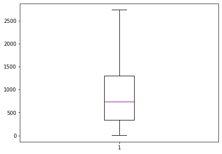

**Download** (right-click, save target as ...) this jupyterlab notebook from:

[https://3.137.111.182/engr-1330-webbook/8-Labs/Lab15/Lab15.ipynb](https://3.137.111.182/engr-1330-webbook/8-Labs/Lab15/Lab15.ipynb)

**Download** (right-click, save target as ...) AirTraffic database file from: 

[https://3.137.111.182/engr-1330-webbook/8-Labs/Lab15/AirTraffic.csv](https://3.137.111.182/engr-1330-webbook/8-Labs/Lab15/AirTraffic.csv)

**Download** (right-click, save target as ...) Lubbock_Oct_T&P database file from: 

[https://3.137.111.182/engr-1330-webbook/8-Labs/Lab15/Lubbock_Oct_T&P.csv](https://3.137.111.182/engr-1330-webbook/8-Labs/Lab15/Lubbock_Oct_T&P.csv)

# <font color=darkred>Laboratory 15: "Avoiding Data Alexithymia" or "Perks of Using Descriptive Statistics</font>


```python
# Preamble script block to identify host, user, and kernel
import sys
! hostname
! whoami
print(sys.executable)
print(sys.version)
print(sys.version_info)
```

    DESKTOP-EH6HD63
    desktop-eh6hd63\farha
    C:\Users\Farha\Anaconda3\python.exe
    3.7.4 (default, Aug  9 2019, 18:34:13) [MSC v.1915 64 bit (AMD64)]
    sys.version_info(major=3, minor=7, micro=4, releaselevel='final', serial=0)


## Full name: 
## R#: 
## Title of the notebook:
## Date:
___

# <font color=purple>Descriptive Statistics with Python</font>


```python
# Let's import the necessary libraries:
import numpy as np
import pandas as pd
import statistics
import scipy.stats
import matplotlib.pyplot as plt 
```

___
### Example1: 
__1. Read the "AirTraffic.csv" file as a dataframe and check its first few rows.__<br>
__2. Use descriptive functions of the Pandas library to learn more about the dataframe__<br>
__3. Compute the arithmetic and harmonic mean of 'Distance'.__<br>
__4. Find the median of 'Distance'.__<br>
__5. Find the range of 'Distance'.__<br>
__6. Find the IQR of 'Distance'.__<br>
__7. Use descriptive functions of the Pandas library to get a 5-number summary of 'Distance'. Plot a box plot without outliers.__<br>
__8. Find the variance and standard deviation of 'Distance'.__<br>
__9. Find the skewness and kurtosis 'Distance'.__<br>


```python
AT = pd.read_csv("AirTraffic.csv")         #Read the .csv file a data frame
AT.head()
```


<div>
<style scoped>
    .dataframe tbody tr th:only-of-type {
        vertical-align: middle;
    }

    .dataframe tbody tr th {
        vertical-align: top;
    }

    .dataframe thead th {
        text-align: right;
    }
</style>
<table border="1" class="dataframe">
  <thead>
    <tr style="text-align: right;">
      <th></th>
      <th>DISTANCE</th>
      <th>ORIGIN_COUNTRY_NAME</th>
      <th>DEST_COUNTRY_NAME</th>
      <th>AIRCRAFT_GROUP</th>
      <th>CLASS</th>
      <th>DATA_SOURCE</th>
    </tr>
  </thead>
  <tbody>
    <tr>
      <td>0</td>
      <td>3855</td>
      <td>United States</td>
      <td>Germany</td>
      <td>6</td>
      <td>G</td>
      <td>IF</td>
    </tr>
    <tr>
      <td>1</td>
      <td>5805</td>
      <td>United States</td>
      <td>Germany</td>
      <td>6</td>
      <td>G</td>
      <td>IF</td>
    </tr>
    <tr>
      <td>2</td>
      <td>801</td>
      <td>United States</td>
      <td>United States</td>
      <td>6</td>
      <td>G</td>
      <td>DF</td>
    </tr>
    <tr>
      <td>3</td>
      <td>4343</td>
      <td>United States</td>
      <td>Germany</td>
      <td>6</td>
      <td>G</td>
      <td>IF</td>
    </tr>
    <tr>
      <td>4</td>
      <td>5142</td>
      <td>United States</td>
      <td>Germany</td>
      <td>6</td>
      <td>G</td>
      <td>IF</td>
    </tr>
  </tbody>
</table>
</div>


```python
AT.info()
```

    <class 'pandas.core.frame.DataFrame'>
    RangeIndex: 118279 entries, 0 to 118278
    Data columns (total 6 columns):
    DISTANCE               118279 non-null int64
    ORIGIN_COUNTRY_NAME    118279 non-null object
    DEST_COUNTRY_NAME      118279 non-null object
    AIRCRAFT_GROUP         118279 non-null int64
    CLASS                  118279 non-null object
    DATA_SOURCE            118279 non-null object
    dtypes: int64(2), object(4)
    memory usage: 5.4+ MB


```python
Distance = AT['DISTANCE']
# Use the mean function from the statistics library
mean = statistics.mean(Distance)
print("The arithmetic mean distance of the 2020 flights is ",round(mean,2),"miles")
hmean = statistics.harmonic_mean(Distance)
print("The harmonic mean distance of the 2020 flights is ",round(hmean,2),"miles")
```

    The arithmetic mean distance of the 2020 flights is  1101.12 miles
    The harmonic mean distance of the 2020 flights is  220.81 miles


```python
Distance = AT['DISTANCE']
# Use the mean function from the statistics library
median = statistics.median(Distance)
print("The median of distance of the 2020  flights is ",median,"miles")
```

    The median of distance of the 2020  flights is  740 miles


```python
Distance = AT['DISTANCE']
Range = np.ptp(Distance) #ptp stands for Peak To Peak
print("The range of distance of the 2020  flights is ",Range,"miles")
```

    The range of distance of the 2020  flights is  9778 miles


    C:\Users\Farha\Anaconda3\lib\site-packages\numpy\core\fromnumeric.py:2389: FutureWarning: Method .ptp is deprecated and will be removed in a future version. Use numpy.ptp instead.
      return ptp(axis=axis, out=out, **kwargs)


```python
Distance = AT['DISTANCE']

IQR = scipy.stats.iqr(Distance)
print("The IQR of distance of the 2020  flights is ",IQR,"miles")
```

    The IQR of distance of the 2020  flights is  968.0 miles


```python
Distance = AT['DISTANCE']
Distance.describe()
```


    count    118279.000000
    mean       1101.120165
    std        1260.423448
    min           1.000000
    25%         335.000000
    50%         740.000000
    75%        1303.000000
    max        9779.000000
    Name: DISTANCE, dtype: float64


```python
fig = plt.figure(figsize =(7, 5))
plt.boxplot(Distance,medianprops={'linewidth': 1, 'color': 'purple'},showfliers=False)

plt.show()
```


    

    


```python
Distance = AT['DISTANCE']
var = statistics.variance(Distance)
sd = statistics.stdev(Distance)
print("The variance and standard deviation of distance of the 2020 flights is ",round(var,2)," and ",round(sd,2)," respectively")
```

    The variance and standard deviation of distance of the 2020 flights is  1588667.27  and  1260.42  respectively


```python
Distance = AT['DISTANCE']
skew = scipy.stats.skew(Distance)
kurtosis = scipy.stats.kurtosis(Distance)
print("The skewness and kurtosis of distance of the 2020 flights is ",round(skew,2)," and ",round(kurtosis,2)," respectively")
```

    The skewness and kurtosis of distance of the 2020 flights is  2.63  and  8.13  respectively


___
### Example: 
__1. Read the "Lubbock_Oct_T&P.csv" file as a dataframe and check its first few rows.__<br>
__2. Use descriptive functions of the Pandas library and explain the format of the dataframe__<br>
__3. Compute the arithmetic and harmonic mean of 'temperature'.__<br>
__4. Find the median of 'precipitation' and 'temperature'.__<br>
__5. Find the range and IQR of 'precipitation'.__<br>
__6. Find the 10th,40th, and 70th percentile of 'temperature'.__<br>
__7. Provide a 5-number summary of 'precipitation'. Plot a box plot without outliers. Interpret it in your own words__<br>
__8. Find the variance and standard deviation of 'precipitation'.__<br>
__9. Find the skewness and kurtosis 'precipitation'.__<br>


```python

```


```python

```


```python

```


```python

```


```python

```


```python

```


```python

```


```python

```


```python

```

___
 <br>


*Here are some great reads on this topic:* 
- __"Python Statistics Fundamentals: How to Describe Your Data"__ by __Mirko Stojiljković__ available at *https://realpython.com/python-statistics/* <br>
- __"Introduction to Descriptive Statistics and Probability for Data Science"__ by __Abhishek Kumar__ available at *https://towardsdatascience.com/intro-to-descriptive-statistics-and-probability-for-data-science-8effec826488*<br>
- __"Statistics for Data Science — A beginners guide to Descriptive Statistics in Python"__ by __Angel Das__ available at *https://towardsdatascience.com/statistics-for-data-science-a-beginners-guide-to-descriptive-statistics-in-python-9e0daa30809a*<br>
- __"Interpreting Data Using Descriptive Statistics with Python"__ by __Deepika Singh__ available at *https://www.pluralsight.com/guides/interpreting-data-using-descriptive-statistics-python*<br>


*Here are some great videos on these topics:* 
- __"Descriptive Statistics Using Scipy , Numpy and Pandas in Python - Tutorial 13"__ by __TheEngineeringWorld__ available at *https://www.youtube.com/watch?v=mWIwXqtZmd8* <br>
- __"Python for Data Analysis: Descriptive Statistics"__ by __DataDaft__ available at *https://www.youtube.com/watch?v=3mELSEnGBvA* <br>
- __"Introduction to Descriptive Statistics"__ by __Teresa Johnson__ available at *https://www.youtube.com/watch?v=QoQbR4lVLrs* <br>

___
 <br>


## Exercise: Why Descriptive Statistics?  <br>

### What is the importance and application of descriptive statistics, especially in Engineering. 

#### _Make sure to cite any resources that you may use._ 


```python

```


